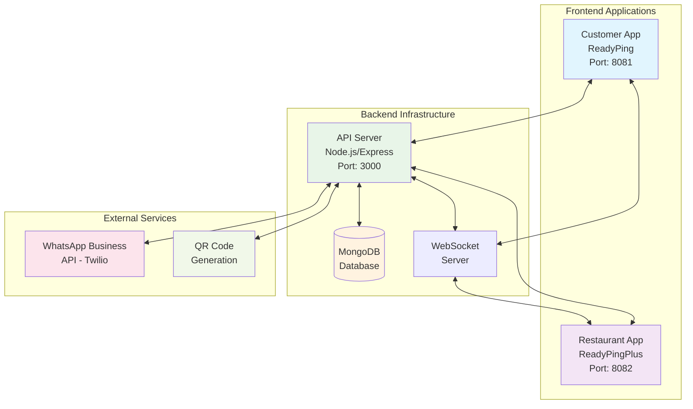
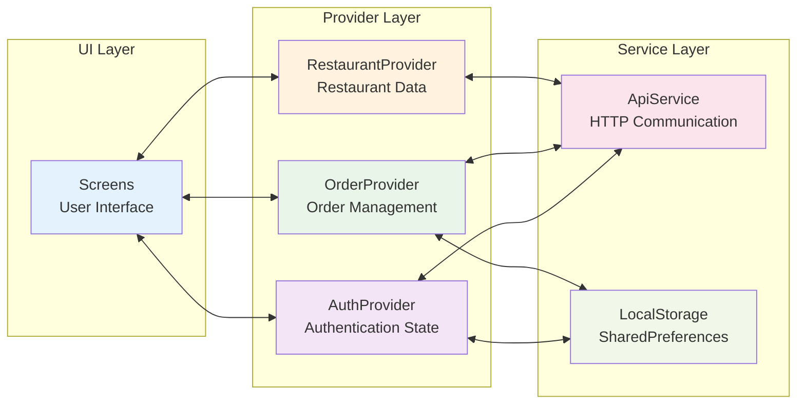
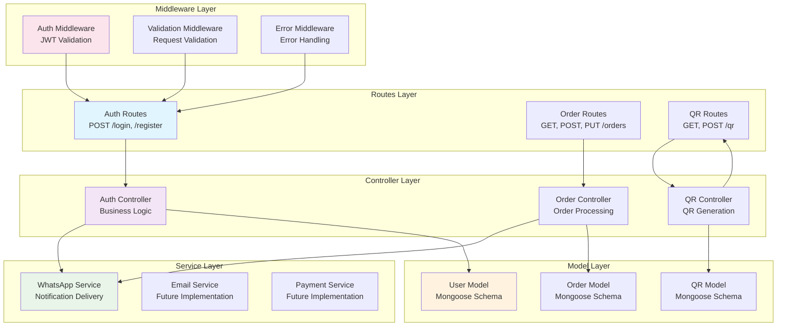
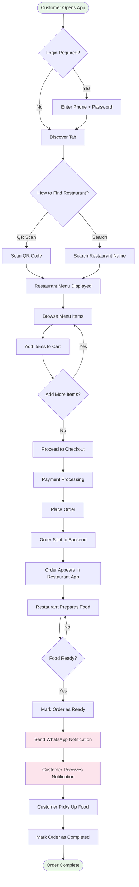
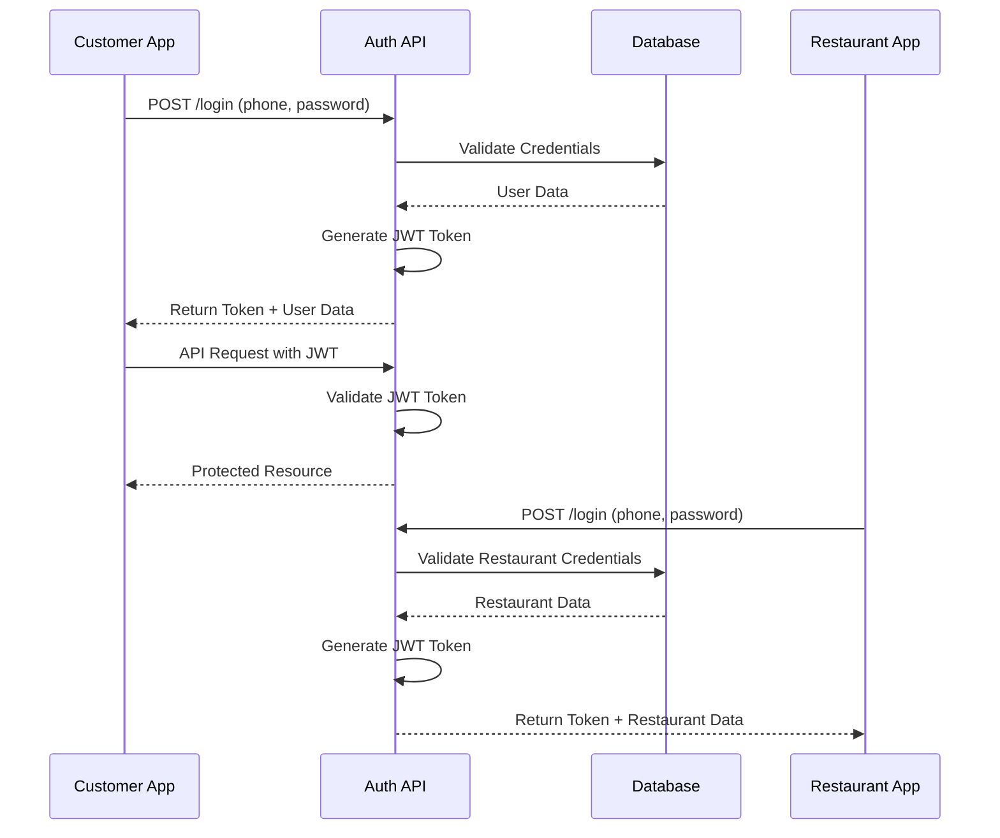
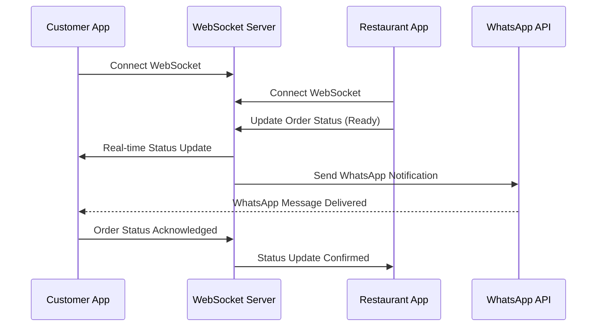
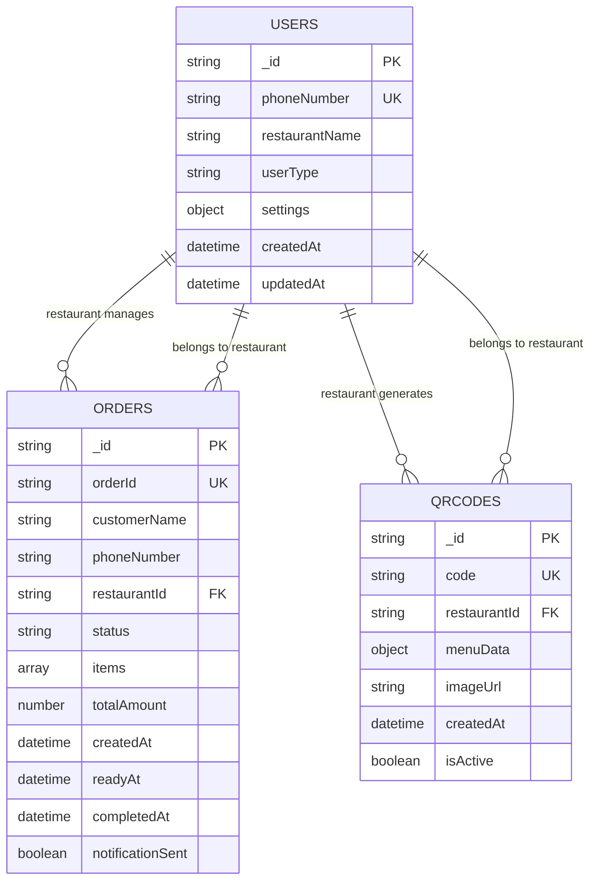
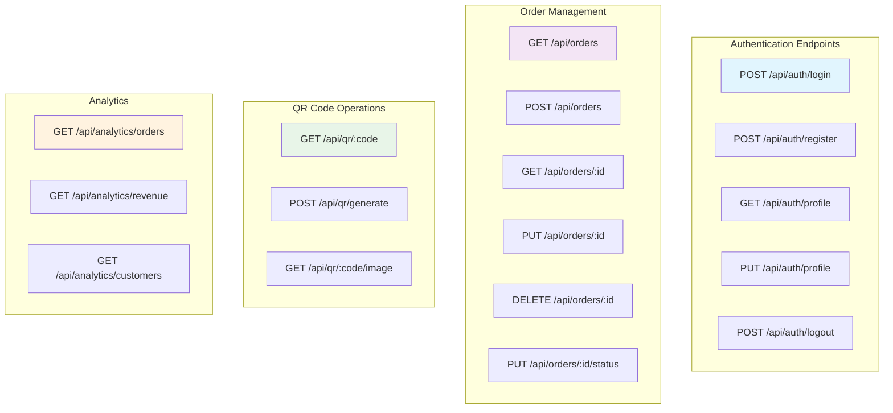
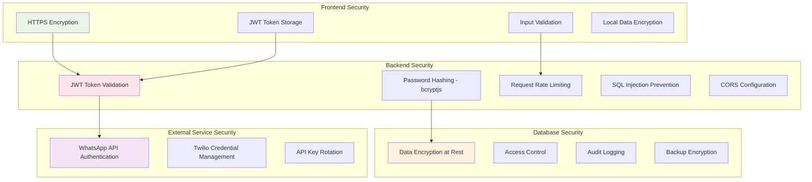
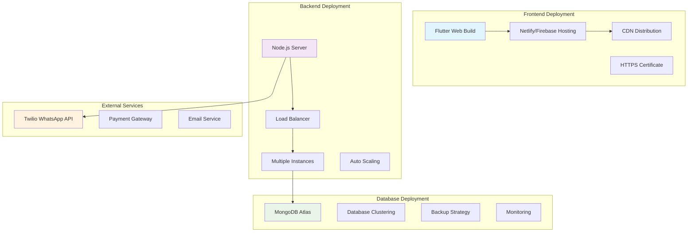

# ReadyPing System Diagrams and Flowcharts

## 1. System Architecture Overview

## 2. Frontend Architecture Pattern

## 3. Backend Layered Architecture

## 4. Order Processing Flowchart

## 5. Authentication Flow

## 6. Real-time Communication Flow

## 7. Database Schema Design

## 8. API Endpoints Structure

## 9. Security Architecture

## 10. Deployment Architecture

---

*These diagrams provide comprehensive visual representation of the ReadyPing system architecture, data flow, and technical implementation suitable for academic research papers and technical documentation.* 